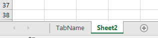
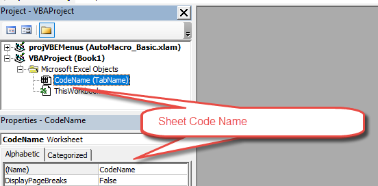

1 - Get Sheet Name

Sheet names are stored in the Name property of the Sheets or Worksheets object.  The Sheet Name is the “tab” name that’s visible at the bottom of Excel:



3 - Get ActiveSheet Name

This will display the ActiveSheet name in a message box:

```vb
MsgBox ActiveSheet.Name
```

5 - Get Sheet Name by index Number

This will display the first worksheet name in a message box:

```vb
MsgBox Sheets(1).Name
```

This will display the name of the last worksheet in the workbook:

```vb
MsgBox Sheets(Sheets.Count).Name
```

7 - Get Sheet Name by Code Name

In the VBA Editor, there is an option to change the “code name” of a Sheet. The code name is not visible to the Excel user and can only be seen in the VBA Editor:




9 - Get Sheet Name by Code Name

In VBA, when working with Sheets, you can reference the usual Tab name:

```vb
Sheets("TabName").Activate
```

or the VBA code name:

```vb
CodeName.Activate
```

Referencing the code name is desirable in case the Sheet tab name ever changes. If you allow you Excel user access to changing sheet names you should reference the code name in your VBA code so that a Sheet tab name mismatch doesn’t cause an error. Sheet code names are discussed in more detail here.


To get the Sheet name using the VBA Code name, do the following:

```vb
MsgBox CodeName.Name
```

10 - Rename Sheet

You can rename Sheets by adjusting the name property of the Sheets or Worksheets object.


11 - Rename ActiveSheet

```vb
ActiveSheet.Name = "NewName"
```

12 - Rename Sheet by Name

```vb
Sheets("OldSheet").Name = "NewName"
```

13 - Rename Sheet by Sheet Index Number

Here we use 1 to rename the first Sheet in the Workbook.

```vb
Sheets(1).Name = "NewName"
```

14 - Rename Sheet by Code Name

This code will rename a sheet using it’s VBA code name (discussed above):

```vb
Component.Name = "NewName"
```

15 - Check if Sheet Name Exists

We created a function to test if a Sheet with a particular name already exists.

```vb
'Test if a Range Exists on a Sheet.
'Leave range blank to test if sheet exists
'Inputs:
' WhatSheet - String Name of Sheet (ex "Sheet1")
' WhatRange (Optional, Default = "A1") - String Name of Range (ex "A1")

Function RangeExists(WhatSheet As String, Optional ByVal WhatRange As String = "A1") As Boolean
    Dim test As Range
    On Error Resume Next
    Set test = ActiveWorkbook.Sheets(WhatSheet).Range(WhatRange)
    RangeExists = Err.Number = 0
    On Error GoTo 0
End Function

The function will return TRUE if the Sheet exists, or FALSE if it does not.
Use the function like so:

Sub Test_SheetExists()
    MsgBox RangeExists("setup")
End Sub
```

16 - Copy Sheet and Rename

This example is from our article on Copying Sheets.

After copying and pasting a Sheet, the newly created sheet becomes the ActiveSheet. So to rename a copied Sheet, simply use `ActiveSheet.Name`:

```vb
Sub CopySheetRename2()

    Sheets("Sheet1").Copy After:=Sheets(Sheets.Count)
    On Error Resume Next
    ActiveSheet.Name = "LastSheet"
    On Error GoTo 0

End Sub
```

Note: We added error handling to avoid errors if the Sheet name already exists.