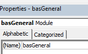

1 - Introduction

The first time you insert a module in VBA, it will automatically be given the name of “Module1” and subsequent module will become Module2, Module3 etc. Similarly, when you insert a UserForm it will be called UserForm1, UserForm2 etc.

3 - Renaming a Module

To rename your module or form, you need to have the properties window switched on in your VBE.

If the properties windows is not showing, press F4 or go to the menu bar and select View > Properties Window.

1) Click on the module you wish to rename in the Project Explorer.

2) Select the name property in the Properties Window (a module will only have this property; a form has multiple properties)

3) Delete the module name (in this case Module1) and type in the name you want to call your module.

4) Press enter to rename the module.

You rename your forms in the same manner.

